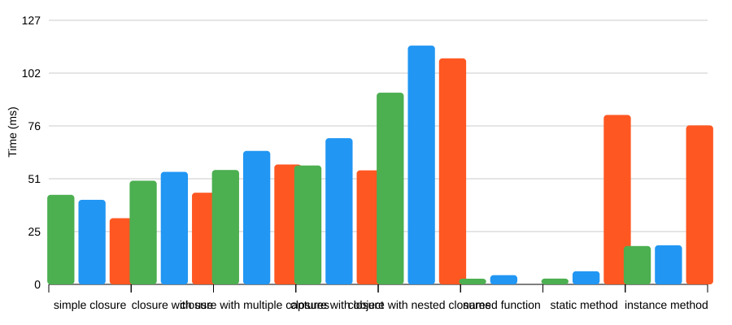
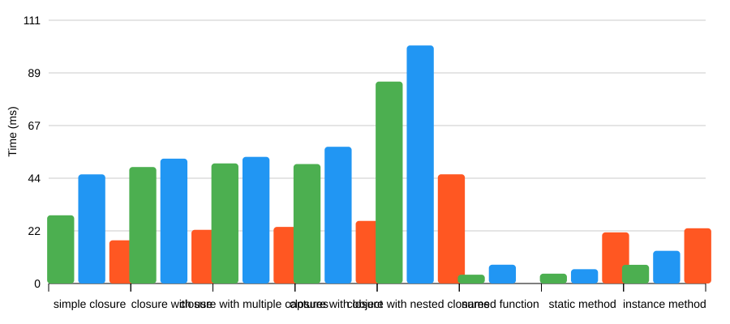

<!-- This file is auto-generated by benchmark.php. Do not edit manually. -->
# Benchmark Results

**Last updated:** 2025-12-29 17:44:03

**Environment:**
- PHP 8.5.1 on Linux
- Serializor: v1.1.1
- Opis/Closure: 4.4.0
- Laravel Serializable Closure: v2.0.7

## Summary

| Test Case | Serializor | Opis | Laravel | Winner (serialize) |
|-----------|------------|------|---------|--------------------|
| simple closure | 50.4ms | 38.4ms | 30.2ms | Laravel |
| closure with use | 55.0ms | 55.6ms | 43.4ms | Laravel |
| complex closure | 59.5ms | 68.9ms | 52.8ms | Laravel |
| closure with object | 61.6ms | 72.3ms | 51.8ms | Laravel |
| closure with nested closures | 117.5ms | 125.5ms | 126.0ms | Serializor |
| named function | 23.2ms | 5.8ms | ERROR | Opis |
| static method | 21.3ms | 7.1ms | 76.8ms | Opis |
| instance method | 25.6ms | 21.5ms | 87.8ms | Opis |

## Serialization Time

## Unserialization Time

## Detailed Results

### Simple Closure

| Library | Serialize | Unserialize | Total |
|---------|-----------|-------------|-------|
| Serializor | 50.37ms | 33.04ms | 83.41ms |
| Opis | 38.37ms | 40.09ms | 78.46ms |
| Laravel | 30.21ms | 16.14ms | 46.36ms |

### Closure With Use

| Library | Serialize | Unserialize | Total |
|---------|-----------|-------------|-------|
| Serializor | 54.96ms | 53.74ms | 108.70ms |
| Opis | 55.63ms | 46.56ms | 102.19ms |
| Laravel | 43.44ms | 20.06ms | 63.50ms |

### Complex Closure

| Library | Serialize | Unserialize | Total |
|---------|-----------|-------------|-------|
| Serializor | 59.53ms | 54.76ms | 114.28ms |
| Opis | 68.92ms | 47.97ms | 116.89ms |
| Laravel | 52.80ms | 21.67ms | 74.47ms |

### Closure With Object

| Library | Serialize | Unserialize | Total |
|---------|-----------|-------------|-------|
| Serializor | 61.63ms | 54.44ms | 116.07ms |
| Opis | 72.32ms | 51.99ms | 124.32ms |
| Laravel | 51.80ms | 23.98ms | 75.78ms |

### Closure With Nested Closures

| Library | Serialize | Unserialize | Total |
|---------|-----------|-------------|-------|
| Serializor | 117.46ms | 108.11ms | 225.58ms |
| Opis | 125.46ms | 101.36ms | 226.82ms |
| Laravel | 125.98ms | 58.08ms | 184.06ms |

### Named Function

| Library | Serialize | Unserialize | Total |
|---------|-----------|-------------|-------|
| Serializor | 23.24ms | 24.45ms | 47.69ms |
| Opis | 5.82ms | 6.00ms | 11.82ms |
| Laravel | ERROR | ERROR | ERROR |

### Static Method

| Library | Serialize | Unserialize | Total |
|---------|-----------|-------------|-------|
| Serializor | 21.31ms | 12.50ms | 33.81ms |
| Opis | 7.07ms | 6.45ms | 13.52ms |
| Laravel | 76.84ms | 23.09ms | 99.93ms |

### Instance Method

| Library | Serialize | Unserialize | Total |
|---------|-----------|-------------|-------|
| Serializor | 25.59ms | 14.04ms | 39.63ms |
| Opis | 21.54ms | 14.97ms | 36.51ms |
| Laravel | 87.82ms | 24.82ms | 112.64ms |

---

*Generated by `php benchmark.php`*
