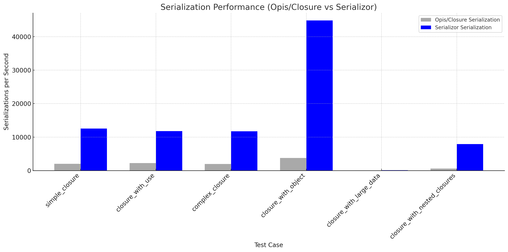
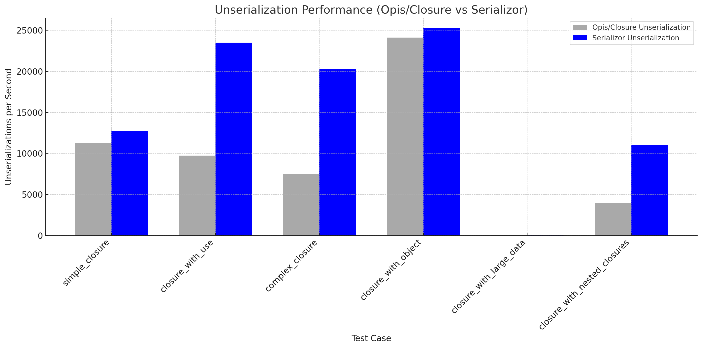

# Serializor: Advanced PHP Serialization Made Simple

**Serializor** is a cutting-edge PHP serialization library designed to simplify the serialization of closures, anonymous classes, and complex data structures. It seamlessly handles scenarios typically challenging for other libraries without requiring modifications to existing code. Whether for distributed computing, caching objects, or job queuing, Serializor ensures that complex data types are serialized and deserialized flawlessly, preserving their behavior and state.

## Advanced Use Cases Supported by Serializor

Serializor is designed to handle a wide range of complex serialization scenarios that other libraries might not support effectively. This capability ensures that developers can manage intricate data structures seamlessly, particularly in environments where data integrity and fidelity are paramount. Here are some key scenarios where Serializor stands out:

### 1. Serialization of Closures with Context

Serializor excels at serializing closures, including those with bound context and scoped variables. Unlike some libraries that only convert closures to serializable representations requiring manual restoration, Serializor automatically serializes and restores closures to their functional state, including any context or `use` variables.

**Supported Scenario**:
- Serializing a closure that modifies a captured variable, ensuring that both the closure and the variable's state are accurately restored after deserialization.

### 2. Handling of Read-Only and Typed Properties

PHP 8.1 introduced read-only properties that cannot be modified after initialization. Serializor can serialize and deserialize objects with read-only properties without altering their state, a functionality not supported by other serialization libraries.

**Supported Scenario**:
- Objects that utilize PHP 8.1's readonly properties, ensuring that these properties are correctly handled and remain unaltered post-deserialization.

### 3. Complex Recursive Structures

Serializor can serialize and deserialize deeply nested or recursive structures without hitting recursion limits or losing references. This is particularly important for applications that handle complex data models where references must be maintained accurately across the serialized state.

**Supported Scenario**:
- Serializing a complex graph of objects where multiple objects reference each other, maintaining accurate linkages and identities through the serialization process.

### 4. Objects with Dynamic Properties

Serializor supports objects that dynamically assign properties at runtime. It ensures that all properties, even those not statically defined in the class, are serialized and restored.

**Supported Scenario**:
- Serializing objects that implement magic methods like `__get` and `__set`, capturing all dynamically assigned properties.

### 5. Closure Binding and Scoping

Serializor provides robust support for closures that are bound to specific object instances or classes, respecting their scope and context accurately during serialization and deserialization.

**Supported Scenario**:
- Serializing a closure that is bound to a specific object instance, ensuring that upon deserialization, the closure continues to operate within the correct scope and retains access to the bound object's methods and properties.

### 6. Security Features

With built-in security features like HMAC signatures, Serializor ensures that serialized data is not tampered with. This feature is crucial for applications that serialize data across less secure channels or store serialized data for long periods.

**Supported Scenario**:
- Serializing sensitive information that needs to be securely transmitted between different parts of an application or stored securely, using HMAC signatures to verify data integrity on deserialization.

### 7. Complex Serialization Transformers

Serializor allows developers to extend its functionality with custom transformers, enabling serialization of otherwise non-serializable objects by converting them into a storable format and back.

**Supported Scenario**:
- Serializing a resource or a database connection handle by implementing a custom transformer that handles the specific requirements and nuances of these types.

## Supports more complex structures

Serializor does not rely on wrapping closures. You can serialize a closure directly, and unserialize it - including for example if your closure is stored in a readonly property in an object.

    $data = $serializor->serialize(function() {});
    $func = $serializor->unserialize($data);

## Performance

Serializor significantly outperforms opis/closure and laravel/serializable-closure, while also being more powerful.

### Serialization Performance

Serializor is order of magnitude faster than Opis/Closure. It is slightly slower on unserialization, but much faster on serialization - more than making up for the slower serialization.






## Features

- **Serialize Closures Without Modification**: Serializor can serialize any closure, even when it’s stored in typed readonly properties (e.g., `public readonly Closure $prop`), without needing to wrap closures in special types like `SerializableClosure`.
  
- **Supports Typed Readonly Properties**: No need to change property types or structure your code around special classes to serialize closures. Serializor can serialize and deserialize closures while maintaining compatibility with PHP’s type system, including readonly properties.
  
- **Serialization of Anonymous Classes**: Serializor supports serializing anonymous classes. While the deserialized class will not be perfectly identical, it will retain the structure and functionality, making it highly usable in most cases.
  
- **Efficient and Secure**: Serializor uses a machine-specific secret to ensure that data serialized on one machine is deserialized correctly on the same machine, making the library secure and consistent across system reboots.

- **Seamless Proxy Object Support**: For advanced use cases where objects returned from worker processes need to be represented in the main process, Serializor can return proxy instances that support `__get`, `__set`, and `__call`, allowing RPC-like interaction between processes.

## Installation

```bash
composer require yourname/serializor
```

## Basic Usage

Serializor is designed to work seamlessly as a drop-in replacement for PHP’s native `serialize()` and `unserialize()` functions. Here’s how you can use it:

### Serialization of Closures

```php
$closure = function () {
    return 'Hello from closure!';
};

$serialized = Serializor::serialize($closure);
$unserializedClosure = Serializor::unserialize($serialized);

// Execute the closure
echo $unserializedClosure(); // Output: Hello from closure!
```

### Serializing Typed Readonly Properties

Serializor handles typed readonly properties with no modifications required:

```php
class MyClass {
    public readonly Closure $myClosure;

    public function __construct() {
        $this->myClosure = function() {
            return 'I am serialized!';
        };
    }
}

$instance = new MyClass();
$serialized = Serializor::serialize($instance);
$unserializedInstance = Serializor::unserialize($serialized);

echo $unserializedInstance->myClosure(); // Output: I am serialized!
```

### Serializing Anonymous Classes

Serializor supports the serialization of anonymous classes:

```php
$anonClass = new class {
    public function sayHello() {
        return 'Hello from anonymous class!';
    }
};

$serialized = Serializor::serialize($anonClass);
$unserializedClass = Serializor::unserialize($serialized);

echo $unserializedClass->sayHello(); // Output: Hello from anonymous class!
```

## Comparison with Alternative Approaches

Many serialization libraries require you to wrap closures with special types, like `Opis\Closure`’s `SerializableClosure`. This often leads to the following issues:

1. **Modifying the Class Structure**: You’re forced to change the property types in your classes to support both `Closure` and `SerializableClosure`. For example:
   ```php
   public Closure|SerializableClosure $myClosure;
   ```

   This complicates your code and requires you to adjust the types throughout your codebase.

2. **Typed Readonly Properties**: Libraries like `Opis\Closure` do not handle typed readonly properties natively, especially with the strict type `public readonly Closure $prop`. You would need to remove the type hint or change the type altogether to something more flexible.

3. **Additional Boilerplate**: Wrapping closures in special classes like `SerializableClosure` adds unnecessary boilerplate and reduces the readability of your code.

**Serializor** solves these issues:

- **No Type Changes**: With Serializor, there is no need to modify property types or add support for `SerializableClosure`. You can serialize closures stored in `Closure`-typed properties directly without any changes to your class design.
  
- **Typed Readonly Properties**: Serializor supports `public readonly Closure $prop` without breaking the type system or requiring you to adjust property types.

- **Anonymous Classes**: Serializor supports the serialization of anonymous classes out of the box, though deserialization will create a class that is functionally similar but not identical. In many cases, this difference is negligible as long as the behavior of the class is maintained.

## Machine-Specific Secrets

For security, Serializor generates machine-specific secret keys by inspecting certain system files. This ensures that serialization and deserialization work consistently on the same machine but will not allow deserialization on a different machine. If you need cross-machine serialization, you can set a custom secret:

```php
Serializor::setDefaultSecret('your-custom-secret');
```

## Caveats

- **Anonymous Classes**: When serializing anonymous classes, the deserialized class will be similar but not perfectly identical to the original class - they are not the same type. In most use cases, this should not be an issue, but be aware of this limitation.
  
## Performance and Security

Serializor is designed to be both fast and secure. By utilizing machine-specific secrets, it avoids many common security pitfalls associated with PHP serialization. The library has been optimized to handle closures, anonymous classes, and complex object graphs efficiently.


## License

This library is open-source and available under the MIT License.
