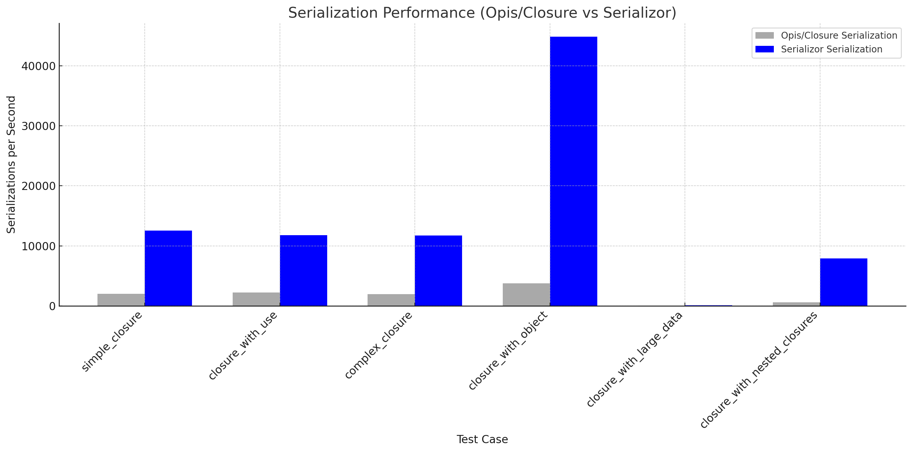
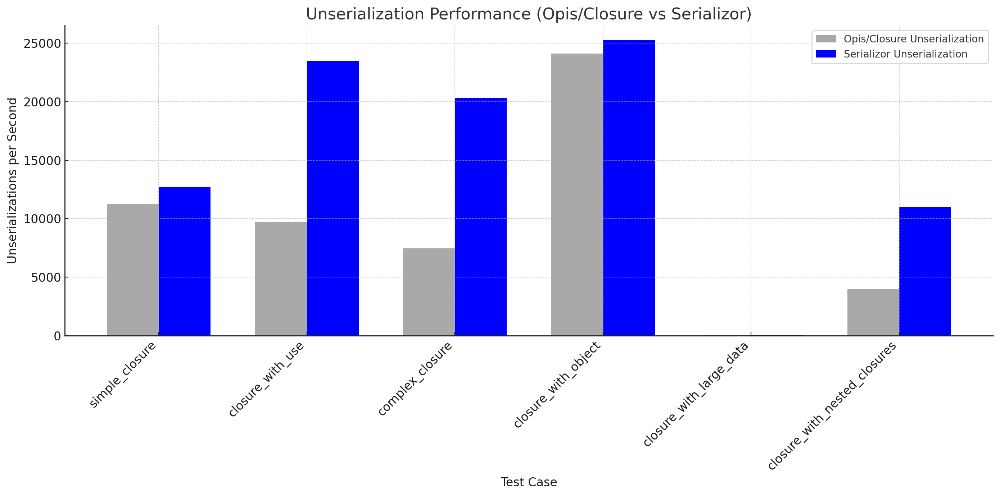

Serializor
====================
[](https://github.com/frodeborli/serializor/actions/workflows/tests.yml)
[](https://packagist.org/packages/frodeborli/serializor)
[](https://packagist.org/packages/frodeborli/serializor)
[](https://packagist.org/packages/frodeborli/serializor)
[](https://packagist.org/packages/frodeborli/serializor)

Serialize closures and anonymous classes
------------------

**Serializor** is a PHP library that allows you to serialize closures,
anonymous classes, and arbitrary data - without wrapper classes or code modifications.

Key features:

- serialize [closures](https://www.php.net/manual/en/functions.anonymous.php) without wrapper classes
- serialize [anonymous classes](https://www.php.net/manual/en/language.oop5.anonymous.php)
- works with [readonly properties](https://www.php.net/manual/en/language.oop5.properties.php#language.oop5.properties.readonly-properties) - no `__serialize()` required
- works with typed `Closure` properties (`public readonly Closure $handler`)
- handles circular and recursive references
- supports WeakReference and WeakMap with correct weak semantics
- supports SPL classes (ArrayObject, SplObjectStorage, SplDoublyLinkedList, etc.)
- supports DateTime classes
- extensible via custom transformers
- optional [HMAC signing](#security) for secure cross-machine serialization
- does not rely on PHP extensions (no FFI or similar dependencies)
- supports PHP 8.2 - 8.5

### Example: Closure serialization

```php
use Serializor\Serializor;

$greet = fn($name) => "Hello, $name!";

$serialized = Serializor::serialize($greet);
$restored = Serializor::unserialize($serialized);

echo $restored('World'); // Hello, World!
```

### Example: Anonymous class serialization

```php
use Serializor\Serializor;

$obj = new class("Hello from anonymous class!") {
    public function __construct(private string $message) {}

    public function greet(): string {
        return $this->message;
    }
};

$serialized = Serializor::serialize($obj);
$restored = Serializor::unserialize($serialized);

echo $restored->greet(); // Hello from anonymous class!
```

### Example: Readonly properties (no class modifications)

```php
use Serializor\Serializor;

class MyService {
    public readonly Closure $handler;

    public function __construct() {
        $this->handler = fn($x) => $x * 2;
    }
}

$service = new MyService();
$serialized = Serializor::serialize($service);  // Just works
$restored = Serializor::unserialize($serialized);

echo ($restored->handler)(21); // 42
```

## Installation

**Serializor** is available on [Packagist] and can be installed via [Composer]:

```bash
composer require frodeborli/serializor
```

## Requirements

* PHP >= 8.2

## Security

By default, Serializor does not sign serialized data. For production use, especially in distributed systems or job queues, you should set a shared secret:

```php
use Serializor\Serializor;

Serializor::setDefaultSecret('your-shared-secret');
```

When a secret is set, all serialized data is HMAC-signed to prevent tampering.

## Custom Serializers

For types that need special handling (like database connections that must be reconnected), you can register custom serialization logic:

```php
use Serializor\Stasis;

Stasis::registerFactory(PDO::class, function (PDO $pdo): MyPDOStasis {
    return MyPDOStasis::fromPDO($pdo);
});
```

See [tests/Transformers/CustomTransformerTest.php](tests/Transformers/CustomTransformerTest.php) for a complete example.

## Comparison with Other Libraries

| Feature | Serializor | opis/closure 4.x | laravel/serializable-closure |
|---------|------------|------------------|------------------------------|
| Closure serialization | Yes | Yes | Yes |
| Anonymous class serialization | Yes | Yes | No |
| No wrapper classes required | Yes | Yes | No |
| Readonly `Closure` properties | Yes | Requires `__serialize()` | No |
| WeakReference / WeakMap | Yes | Yes | No |
| SplObjectStorage | Yes | Yes | No |
| HMAC signing | Yes | Yes | Yes |
| Test coverage | 277 tests | ~70 tests | ~130 tests |

**Serializor's advantages**:
- Works with typed readonly properties and third-party objects without any class modifications
- Most comprehensive test suite covering edge cases from opis/closure GitHub issues
- Supports PHP 8.2-8.5 features including property hooks and pipe operator

## Migrating from Laravel or Opis

Serializor can unserialize data that was serialized by `laravel/serializable-closure` or `opis/closure`, providing a seamless upgrade path. The original library must remain installed for deserialization to work:

```php
use Serializor\Serializor;

// Data serialized with Laravel or Opis can be unserialized with Serializor
// (requires the original library to be installed)
$closure = Serializor::unserialize($legacySerializedData);

// Re-serialize with Serializor - no longer requires the old library
$newSerializedData = Serializor::serialize($closure);
```

This allows gradual migration: keep the old library installed while transitioning, then remove it once all stored data has been re-serialized with Serializor.

## Known Limitations

- Anonymous classes extending internal PHP classes (stdClass, ArrayObject) cannot be serialized
- Multiple closures on the same line with identical signatures cannot be distinguished (PHP limitation)

## History

Serializor was first released on **September 5, 2024**, introducing a novel architecture for PHP closure serialization: direct serialization without wrapper classes, stream wrapper-based reconstruction, WeakMap + ReflectionReference cycle detection, and an extensible transformer system.

Four months later, Opis/Closure v4.0.0 (December 2024) was released as a "complete rewrite" featuring remarkably similar architectural choices. For a detailed technical comparison, see [DESIGN.md](DESIGN.md).

## Performance





## License

**Serializor** is licensed under the [MIT License][license].

[Packagist]: https://packagist.org/packages/frodeborli/serializor "Packagist"
[Composer]: https://getcomposer.org "Composer"
[license]: https://opensource.org/licenses/MIT "MIT License"
